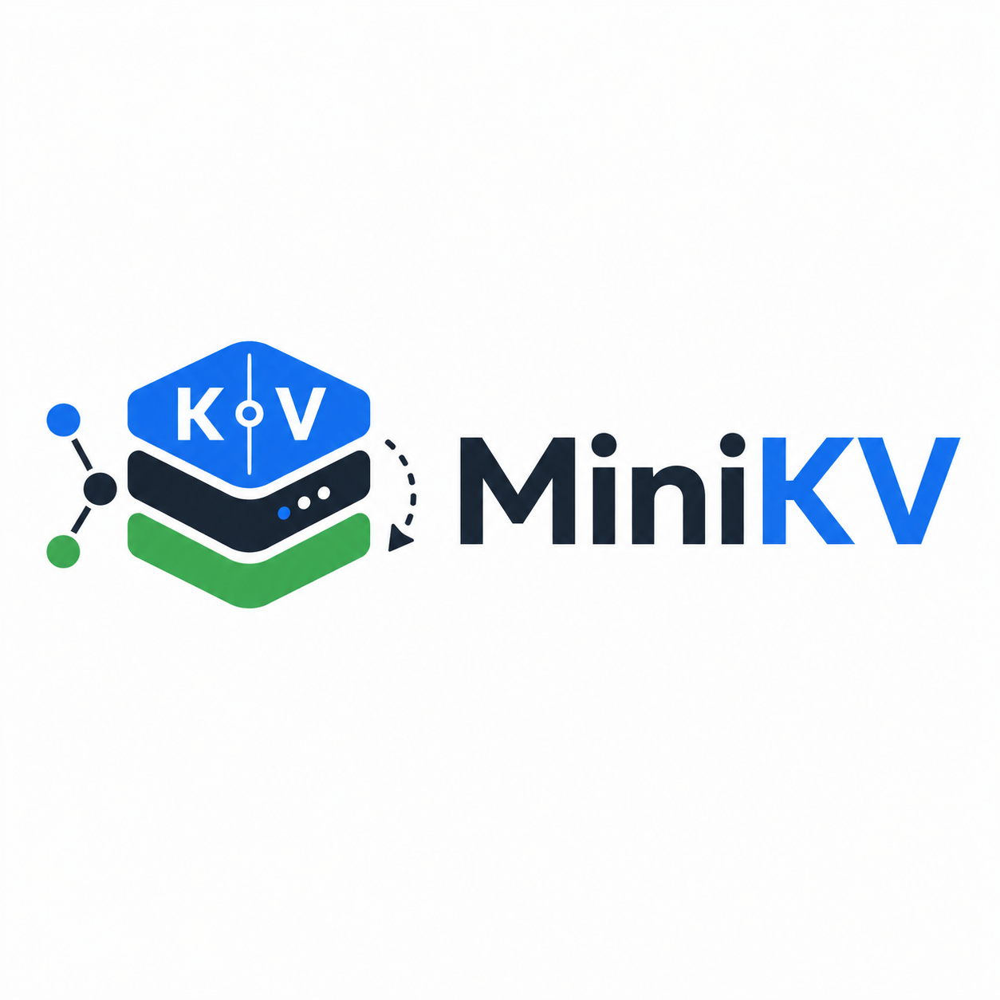

# MiniKV

基于 C++17 实现的轻量级高性能 KV 存储引擎，支持 WAL 预写日志、MemTable 内存表、SSTable 持久化、Bloom Filter 过滤、LRU 热点缓存、后台 Compaction、命令行客户端和本地压测工具。

<!-- PROJECT SHIELDS -->

[![Contributors][contributors-shield]][contributors-url]
[![Forks][forks-shield]][forks-url]
[![Stargazers][stars-shield]][stars-url]
[![Issues][issues-shield]][issues-url]
[![MIT License][license-shield]][license-url]
[![C++17][cpp-shield]][cpp-url]
[![CMake][cmake-shield]][cmake-url]

<!-- PROJECT LOGO -->
<br />

<p align="center">
  <a href="https://github.com/CozyOct1/MiniKV">
    
  </a>

  <h3 align="center">MiniKV</h3>
  <p align="center">
    一个面向 Linux 底层工程实践的 C++ KV 存储引擎，用于验证日志恢复、有序索引、LSM 分层存储、缓存、Compaction 和性能压测能力。
    <br />
    <a href="https://github.com/CozyOct1/MiniKV"><strong>查看项目源码 »</strong></a>
    <br />
    <br />
    <a href="https://github.com/CozyOct1/MiniKV">项目首页</a>
    ·
    <a href="https://github.com/CozyOct1/MiniKV/issues">报告 Bug</a>
    ·
    <a href="https://github.com/CozyOct1/MiniKV/issues">提出新特性</a>
  </p>
</p>

本篇 `README.md` 面向开发者，内容基于当前项目真实代码和本地实测结果编写。

## 目录

- [上手指南](#上手指南)
  - [开发前的配置要求](#开发前的配置要求)
  - [安装步骤](#安装步骤)
  - [基础使用](#基础使用)
- [项目功能](#项目功能)
- [配置说明](#配置说明)
- [文件目录说明](#文件目录说明)
- [开发的架构](#开发的架构)
- [命令行客户端](#命令行客户端)
- [压测与量化结果](#压测与量化结果)
- [核心实现说明](#核心实现说明)
- [使用到的技术](#使用到的技术)
- [版本控制](#版本控制)
- [当前限制](#当前限制)
- [简历写法](#简历写法)
- [作者](#作者)
- [版权说明](#版权说明)

## 上手指南

MiniKV 当前定位是单机轻量级 KV 存储引擎，主要验证以下能力：

- 使用 WAL 实现写前日志和进程重启后的数据恢复
- 使用 `std::map` 实现有序 MemTable
- 将 MemTable 刷盘为不可变 SSTable 文件
- 通过 SSTable 内存索引和 Bloom Filter 降低无效磁盘查询
- 使用 LRU Cache 缓存热点 key 的查询结果
- 通过后台或手动 Compaction 合并历史版本并回收磁盘空间
- 通过 CLI 和 benchmark 工具验证基础功能、吞吐、延迟和磁盘占用

### 开发前的配置要求

1. Linux 或类 Unix 环境
2. C++17 编译器，推荐 `g++ 9+` 或 `clang++ 10+`
3. `make`，用于无 CMake 环境下快速构建
4. CMake 3.16+，可选，用于标准 CMake 构建流程
5. pthread，通常由 Linux 系统默认提供

当前本地实测环境：

```text
g++ 11.4.0
cmake 4.0.2
Python 3.10.12
```

### 安装步骤

1. Clone the repo

```bash
git clone git@github.com:CozyOct1/MiniKV.git
cd MiniKV
```

2. 使用 Makefile 构建

```bash
make -j
```

3. 运行测试

```bash
make test
```

4. 可选：使用 CMake 构建

```bash
cmake -S . -B build -DCMAKE_BUILD_TYPE=Release
cmake --build build -j
ctest --test-dir build --output-on-failure
```

如果当前用户没有 sudo 权限，也可以通过 Conda、uv tool 或本地二进制包安装 CMake，不需要写入系统目录。本机已将 Conda 环境中的 `cmake` 和 `ctest` 链接到 `~/.local/bin`，当前用户可直接使用。

### 基础使用

启动命令行客户端：

```bash
./build/minikv_cli ./data
```

写入数据：

```text
put name minikv
```

读取数据：

```text
get name
```

删除数据：

```text
del name
```

手动刷盘：

```text
flush
```

手动压缩：

```text
compact
```

查看状态：

```text
stats
```

退出客户端：

```text
exit
```

## 项目功能

| 能力 | 当前实现 |
| --- | --- |
| 基础接口 | 提供 `Put`、`Get`、`Delete`、`Flush`、`Compact` API |
| WAL 预写日志 | 写入前先追加 WAL，重启后通过日志重放恢复未刷盘数据 |
| MemTable | 使用 `std::map` 保存有序内存数据，达到阈值后刷盘 |
| SSTable | 使用不可变有序文件保存数据，包含记录区、索引区、Bloom Filter 和 footer |
| Bloom Filter | 打开 SSTable 时加载过滤器，减少不存在 key 的磁盘查找 |
| LRU Cache | 缓存热点 key 的 value，减少重复读取 SSTable |
| LSM 存储 | 支持多个 SSTable 按 sequence 查找最新版本 |
| Compaction | 合并多个 SSTable，只保留最新版本并清理删除标记 |
| 后台任务 | 支持后台线程定期检查并触发 Compaction |
| 并发控制 | 使用读写锁区分读路径和写路径，保护 MemTable 与 SSTable 元数据 |
| CLI | 提供交互式 `put`、`get`、`del`、`flush`、`compact`、`stats` 命令 |
| Benchmark | 统计顺序写、随机读、QPS、P95、P99 和 Compaction 前后磁盘占用 |
| 测试 | 覆盖 Put/Get/Delete、Flush/Reopen、WAL Recovery 和 Compaction 最新版本保留 |

## 配置说明

MiniKV 通过 `minikv::Options` 配置数据库参数。

| 参数 | 默认值 | 说明 |
| --- | ---: | --- |
| `dir` | `minikv_data` | 数据目录 |
| `memtable_bytes_limit` | `4 * 1024 * 1024` | MemTable 触发刷盘的近似内存阈值 |
| `block_cache_capacity` | `16 * 1024 * 1024` | LRU Cache 容量 |
| `bloom_bits_per_key` | `10` | Bloom Filter 每个 key 使用的 bit 数 |
| `level0_compaction_trigger` | `4` | 后台 Compaction 触发的 SSTable 数量阈值 |
| `max_level` | `3` | 预留的最大层级配置 |
| `sync_wal` | `false` | 是否每次 WAL 写入后调用同步刷盘 |
| `background_compaction` | `true` | 是否开启后台 Compaction 线程 |
| `compaction_interval_ms` | `1000` | 后台 Compaction 检查间隔 |

示例：

```cpp
minikv::Options options;
options.dir = "./data";
options.memtable_bytes_limit = 1 * 1024 * 1024;
options.block_cache_capacity = 32 * 1024 * 1024;
options.background_compaction = true;

std::unique_ptr<minikv::DB> db;
auto status = minikv::DB::Open(options, &db);
```

## 文件目录说明

```text
MiniKV
├── include/minikv/
│   ├── bloom_filter.h     Bloom Filter 接口
│   ├── db.h               对外 KV 数据库 API
│   ├── lru_cache.h        LRU 缓存接口
│   ├── options.h          数据库配置项
│   └── status.h           状态码与错误信息
├── src/
│   ├── bloom_filter.cpp   Bloom Filter 实现
│   ├── db.cpp             DB 写入、读取、恢复、刷盘和 Compaction 实现
│   ├── io_util.h          二进制编码和解码工具
│   ├── lru_cache.cpp      LRU 缓存实现
│   ├── record.h           内部记录结构
│   ├── sstable.cpp        SSTable 构建、打开和查询
│   ├── sstable.h          SSTable 内部接口
│   ├── status.cpp         Status 实现
│   ├── wal.cpp            WAL 追加写和重放
│   └── wal.h              WAL 内部接口
├── tools/
│   ├── minikv_cli.cpp     交互式命令行客户端
│   └── minikv_bench.cpp   本地压测工具
├── tests/
│   └── minikv_tests.cpp   基础功能测试
├── images/
│   ├── logo.png           项目 Logo
│   └── logo.svg           备用矢量 Logo
├── CMakeLists.txt         CMake 构建配置
├── Makefile               无 CMake 环境下的构建入口
├── LICENSE                MIT License
└── README.md
```

## 开发的架构

```text
              ┌─────────────────────┐
              │      MiniKV API      │
              │ Put / Get / Delete   │
              └──────────┬──────────┘
                         │
              ┌──────────▼──────────┐
              │      WAL Append      │
              │ current.wal          │
              └──────────┬──────────┘
                         │
              ┌──────────▼──────────┐
              │      MemTable        │
              │ std::map ordered KV  │
              └──────────┬──────────┘
                         │ flush
              ┌──────────▼──────────┐
              │      SSTable         │
              │ data + index + bloom │
              └──────────┬──────────┘
                         │
          ┌──────────────▼──────────────┐
          │       LSM Compaction         │
          │ merge latest versions        │
          └─────────────────────────────┘
```

读路径：

```text
Get(key)
  -> MemTable
  -> LRU Cache
  -> SSTable Bloom Filter
  -> SSTable Index
  -> SSTable Record
```

写路径：

```text
Put/Delete
  -> Append WAL
  -> Update MemTable
  -> Flush MemTable to SSTable
  -> Truncate WAL
```

## 命令行客户端

启动：

```bash
./build/minikv_cli ./data
```

支持命令：

| 命令 | 说明 |
| --- | --- |
| `put <key> <value>` | 写入或覆盖 key |
| `get <key>` | 读取 key |
| `del <key>` | 删除 key |
| `flush` | 将 MemTable 主动刷盘为 SSTable |
| `compact` | 手动触发 Compaction |
| `stats` | 查看当前 sequence 和近似内存占用 |
| `exit` | 退出客户端 |

## 压测与量化结果

运行压测：

```bash
./build/minikv_bench 100000 ./bench_data
```

本地小规模验证命令：

```bash
./build/minikv_bench 1000 /tmp/minikv_bench_data
```

当前实测结果：

| 场景 | 数据量 | 指标 | 结果 |
| --- | ---: | --- | ---: |
| 顺序写 | 1000 | QPS | 123261 |
| 顺序写 | 1000 | P95 | 6us |
| 顺序写 | 1000 | P99 | 10us |
| 随机读 | 1000 | QPS | 2409214 |
| 随机读 | 1000 | P95 | 0us |
| 随机读 | 1000 | P99 | 0us |
| 磁盘占用 | 1000 | Compaction 前 | 67984 bytes |
| 磁盘占用 | 1000 | Compaction 后 | 67984 bytes |

说明：

- 小数据量测试主要用于验证工具链和统计逻辑是否可用。
- 真实性能会受到磁盘、CPU、编译参数、数据分布、是否开启 WAL 同步刷盘等因素影响。
- 当前 benchmark 的读取命中 LRU Cache 后延迟可能低于微秒计时精度，因此会出现 `0us`。

## 核心实现说明

### WAL 恢复

写入请求会先编码为 WAL 记录并追加到 `current.wal`，再更新 MemTable。数据库打开时会扫描 WAL，将未刷盘数据重放回 MemTable，从而保证进程退出后的基础恢复能力。

### SSTable 文件格式

SSTable 使用二进制文件保存不可变数据，主要包含：

- 文件 magic
- 有序 record 数据区
- 稀疏索引区
- Bloom Filter 区
- footer 元信息

打开 SSTable 时会加载索引和 Bloom Filter，查询时先判断 key 范围，再检查 Bloom Filter，最后通过索引定位记录偏移。

### Compaction

Compaction 会读取多个 SSTable 中的历史版本，按 key 保留 sequence 最大的记录。对于删除标记，Compaction 会在确认最新版本为删除后丢弃该 key，从而回收磁盘空间。

### 并发控制

DB 内部使用 `std::shared_mutex` 保护 MemTable、SSTable 列表和 sequence。读请求使用共享锁，写入、刷盘和压缩使用独占锁。后台 Compaction 线程通过条件变量定期检查是否需要合并。

## 使用到的技术

- C++17
- STL：`std::map`、`std::vector`、`std::shared_mutex`、`std::filesystem`
- POSIX：`fsync`
- WAL
- SSTable
- Bloom Filter
- LRU Cache
- LSM-Tree
- Background Compaction
- Makefile
- CMake

## 版本控制

当前项目使用 Git 进行版本管理，远程仓库：

```text
git@github.com:CozyOct1/MiniKV.git
```

建议提交前执行：

```bash
make test
```

## 当前限制

- 当前 MemTable 使用 `std::map`，尚未实现 SkipList。
- SSTable 查询会按表级别查找，尚未实现 block cache 和分块压缩。
- Compaction 当前采用简化合并策略，没有完整实现 LevelDB 风格的多层 fanout 和重叠范围选择。
- WAL 默认不强制每次写入 `fsync`，如果需要更强持久化语义，需要开启 `sync_wal`。
- Benchmark 是轻量本地压测工具，不等同于生产级性能评估。
- 当前测试覆盖核心流程，尚未覆盖高并发长时间运行、异常断电和大规模数据集。

## 简历写法

### MiniKV 高性能 KV 存储引擎

基于 C++17 实现轻量级 KV 存储引擎，支持 Put / Get / Delete、WAL 崩溃恢复、SSTable 持久化、LSM-Tree 分层存储、Bloom Filter 过滤、LRU 热点缓存和后台 Compaction，重点验证存储系统在读写性能、异常恢复和磁盘空间回收场景下的工程能力。

- 基于 WAL + MemTable + SSTable 设计写入链路，写入请求先追加预写日志再更新内存表，进程重启后可通过日志重放恢复数据，保证基础持久化能力。
- 实现 SSTable 文件格式，包括有序数据记录、索引元信息、footer 和 Bloom Filter，减少无效磁盘查找，提高不存在 key 查询性能。
- 设计简化 LSM-Tree 存储结构和后台 Compaction 机制，定期合并多个 SSTable，清理过期版本和删除标记，降低读放大和磁盘空间占用。
- 实现 LRU Cache 缓存热点 key，并通过读写锁优化并发访问路径，提升热点查询吞吐。
- 编写 CLI 和 Benchmark 工具，对顺序写、随机读和 Compaction 场景进行测试，统计 QPS、P95、P99 和磁盘占用变化。

## 版权说明

该项目签署 MIT 授权许可，详情请参阅 [LICENSE](LICENSE)。

<!-- links -->
[contributors-shield]: https://img.shields.io/github/contributors/CozyOct1/MiniKV.svg?style=flat-square
[contributors-url]: https://github.com/CozyOct1/MiniKV/graphs/contributors
[forks-shield]: https://img.shields.io/github/forks/CozyOct1/MiniKV.svg?style=flat-square
[forks-url]: https://github.com/CozyOct1/MiniKV/network/members
[stars-shield]: https://img.shields.io/github/stars/CozyOct1/MiniKV.svg?style=flat-square
[stars-url]: https://github.com/CozyOct1/MiniKV/stargazers
[issues-shield]: https://img.shields.io/github/issues/CozyOct1/MiniKV.svg?style=flat-square
[issues-url]: https://github.com/CozyOct1/MiniKV/issues
[license-shield]: https://img.shields.io/github/license/CozyOct1/MiniKV.svg?style=flat-square
[license-url]: https://github.com/CozyOct1/MiniKV/blob/main/LICENSE
[cpp-shield]: https://img.shields.io/badge/C%2B%2B-17-blue.svg?style=flat-square
[cpp-url]: https://isocpp.org/
[cmake-shield]: https://img.shields.io/badge/CMake-3.16%2B-064f8c.svg?style=flat-square
[cmake-url]: https://cmake.org/
